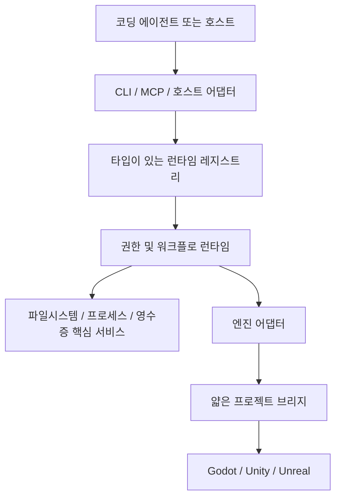

# 아키텍처

> 상태: Node.js/TypeScript 제어 계층 기반을 일부 구현했습니다. 공개 엔진 변경, 실시간 브리지, 증거 내보내기는 아직 없습니다.

[English](architecture.md) · [문서 안내](README.ko.md)

## 전체 구조

엔진별 코드는 얇게 유지하고, 공통 식별·권한·워크플로·증거 규칙은 제어 계층 한 곳에서 관리합니다.

공통 제어 계층은 Node.js와 TypeScript로 만듭니다. 예정된 브리지는 Godot에 GDScript, Unity에 C#, Unreal에 Python 또는 C++를 사용합니다. 그 밖의 Python은 격리된 Blender나 머신러닝 작업에만 사용합니다.

## 단일 기준 정보

검증된 레지스트리 하나가 명령, 스킬, 워크플로, 스키마, 팩의 식별 정보를 소유합니다. CLI 도움말, 전달 정보, MCP 도구 스키마, 문서 상태, 스킬 경로는 이 레지스트리에서 파생합니다.

생성된 표면은 일치하는 처리기와 런타임 경계가 생기기 전까지 설명 정보일 뿐입니다. 등록되지 않은 명령은 거부하며 내부 명령은 공개 CLI와 MCP에 노출하지 않습니다.

## 패키지 경계

| 패키지 | 현재 책임 |
| --- | --- |
| `contracts` | 버전이 있는 스키마와 의미 검증 |
| `registry` | 설명자 검증, 결정적 경로 선택, 생성, 해시 |
| `core` | 프로젝트 식별, 안전한 경로, 비교 후 교체 쓰기, 프로세스 한도, 권한, 범위가 제한된 메모리 승인 서명, 워크플로, 영수증, 산출물 기반 |
| `project-runtime` | 정적 프로젝트 검사와 비공개 초기화 기반 |
| `pack-runtime` | 읽기 전용 팩 검사와 비공개 소유권·트랜잭션·지속 실행·복구·증거 재조정 기반 |
| `skill-runtime` | 패키지 스킬 검증·대상 검사와 쓰기 없는 관리 팩 사전 검사 |
| `evidence` | 프로세스·테스트 결과 정규화와 제한된 보존 산출물 검사 |
| `cli` | 소스에서 실행하는 계획·읽기·정적 명령 9개 |
| `mcp` | 레지스트리 정보에서 골라 노출하는 프로젝트 단위 읽기 전용 STDIO 도구 |
| `codex-adapter` | 쓰기 없는 프로젝트 설정·스킬 대상 계획과 호스트가 수명을 소유하는 비공개 승인 표시·서명 |
| `godot-adapter` | 공개 정적 Godot 보고와 안전 차단되는 비공개 호스트 도구 사전 검사 기반 |

Unity·Unreal 어댑터와 모든 프로젝트 브리지는 아직 계획 단계입니다.

레지스트리는 패키지 스킬 12개를 파일 해시로 묶은 하나의 실험적 관리 팩으로 정의합니다. 비공개 사전 검사는 프로젝트 식별 정보, 설치 상태, 정확한 파일 해시, 각 스킬 디렉터리의 직접 소유권을 기준으로 팩 추가 가능 여부를 판정합니다. 별도의 비공개 실행기는 최신 `ready` 계획, 정확한 설치 승인, 프로젝트 쓰기 차선이 모두 있을 때만 계획을 적용합니다. 승인 직전에 계획을 다시 검사하고, 비교 후 교체 방식의 소유권·롤백과 지속 체크포인트, 실행 영수증, 내용 주소형 종료 트랜잭션 증거를 남깁니다. 복사했거나 오래됐거나 취소됐거나 승인되지 않았거나 충돌한 계획은 관리 파일을 바꾸기 전에 멈춥니다. 이 경로를 호출하는 공개 명령은 없습니다.

두 번째 내부 실행기는 조치 가능한 팩 복구 보고서를 별도 복구 실행 식별 정보로 닫습니다. 기존 트랜잭션 식별 정보는 원래 저널을 가리키고, 복구 실행 식별 정보는 승인·차선 소유권·체크포인트·영수증·증거를 가리킵니다. 실제 상태 종료와 모든 지속 실행 기록이 일치하지 않으면 성공을 반환하지 않습니다. 증거가 덜 저장된 경우에는 자동 재시도 대신 나중에 상태를 맞출 수 있는 미완료 체크포인트를 남깁니다.

제한된 내부 재조정 경로는 팩 저널에 완전하고 안정된 종료 증거가 이미 있을 때 이 체크포인트를 닫습니다. 새 실행·승인·영수증을 사용하고, 정확한 대상 체크포인트 헤드와 대상 영수증 상태를 다시 관찰하며, 원래 변경 명령은 호출하지 않습니다. 대상에는 추가 전용 재조정 정보만 붙이고, 실행하지 않은 원래 시도를 만들거나 기존 영수증 체인을 고쳐 쓰지 않습니다. 첫 버전은 명령 단계에서 불확실해진 한 단계 팩 복구 체크포인트만 받습니다. 여러 단계 워크플로, 롤백 단계, 엔진 프로세스, 에디터 변경은 아직 지원하지 않습니다.

승인 표시, 서명, 최종 권한 판정은 서로 다른 경계로 유지합니다. 핵심 실행부는 호출자가 직접 건넨 정규 Ed25519 키 하나를 같은 프로세스의 핸들로 가져오고, 권한 중개기가 신뢰할 공개키를 파생하며, 짧고 사용 횟수가 제한된 서명기 사용권을 만들 수 있습니다. 범위 제한 사용 도우미는 콜백이 성공하거나 실패한 뒤 서명기를 닫으며, 콜백이 핸들을 보관하거나 직접 닫아도 같은 규칙을 지킵니다. 키 파일을 읽거나 쓰지 않고 영속 키 저장소도 제공하지 않습니다.

비공개 로컬 호스트 실행부는 정확한 승인 세션에서 서명 만료 시각과 사용 횟수를 가져와 표시와 최종 권한 판정을 그 수명 안에서 수행하고, 호출자 소유 키는 열어 둡니다. 표시부에는 키와 서명기를 전달하지 않습니다. 내구성 있는 작업 실행·상태·복구는 아직 이 실행부에 연결하지 않았습니다.

## 현재 읽기 흐름

1. 등록된 공개 명령과 선언된 플래그만 해석합니다.
2. 정확한 설명자를 읽고 입력 스키마를 검증합니다.
3. 하나의 정규 프로젝트 루트를 묶고 제한된 파일과 상태만 검사합니다.
4. 누락, 모호함, 차단, 알 수 없음 상태를 그대로 보존합니다.
5. 완성된 보고서가 설명자의 출력 스키마와 맞는지 검사합니다.
6. 사람이 읽는 출력 또는 정규 JSON을 만들고 안정된 종료 코드로 바꿉니다.

MCP 실행부도 같은 명령과 스키마 식별 정보를 사용합니다. 시작할 때 프로젝트 하나와 명시한 읽기 전용 도구 목록을 묶습니다. 메시지 수, 미응답 요청, 입력·출력 바이트, 제한 시간, 취소 정산에 상한을 둡니다.

## 예정된 변경 흐름

프로젝트를 변경하는 워크플로에는 현재 공개 CLI에 없는 여러 경계가 더 필요합니다.

1. 프로젝트 프로필과 `FeatureContract`를 묶습니다.
2. 정확한 엔진 기능과 세션 식별 정보를 협상합니다.
3. 좁은 승인을 받고 프로젝트 또는 에디터 차선을 획득합니다.
4. 유한 워크플로를 확정하고 승인 체크포인트를 저장합니다.
5. 각 효과 직전에 식별 정보를 다시 검사합니다.
6. 출력, 시간, 파일, 바이트, 복구 횟수 예산 안에서 실행합니다.
7. 영수증과 증거를 저장한 뒤 상태를 맞추거나 롤백합니다.

결과를 알 수 없는 효과가 생기면 실행 상태를 `uncertain`으로 바꿉니다. 이 상태에서 바로 실행으로 돌아갈 수 없습니다. 지원하는 공급자가 별도의 완전한 증거로 종료 상태만 확정할 수 있으며, 그렇지 않으면 계속 차단합니다.

## 식별 정보와 실행 차선

권한에는 프로젝트 루트, 프로필, 기능, 레지스트리, 명령, 처리기, 실행 파일, 프로세스 시작, 에디터 세션, 씬·월드, 팩 해시가 필요에 따라 포함됩니다. 전송 토큰이나 직렬화한 보고서 하나만으로는 충분하지 않습니다.

`parallel-read`는 서로 독립적인 읽기 전용 작업에만 씁니다. 나머지 차선은 작업을 하나씩 실행합니다. 각 프로젝트는 에디터 차선을 하나만 가질 수 있습니다. 어느 인스턴스를 써야 할지 확실하지 않으면 멈춥니다.

## 엔진 어댑터

모든 어댑터는 [핵심 개념](concepts.ko.md)의 공통 수명주기를 따릅니다. 수명주기의 각 작업을 구현하거나 지원하지 않는다고 명시해야 합니다.

지원하지 않는 작업과 부족한 증거는 그대로 보고합니다. 얇은 프로젝트 브리지는 승인된 에디터·런타임 작업에 꼭 필요한 기능만 노출합니다. 인증 누락, 다른 프로젝트, 오래된 세션, 스키마 불일치, 불확실한 변경은 안전하게 차단해야 합니다.

## 사용자 프로젝트 상태

앞으로 초기화한 게임 프로젝트는 `.ai-game-playbook/`에 이식 가능한 프로필, 기능 계약, 정책, 팩 잠금을 둡니다. 팀과 공유할 이 파일들은 Git에 커밋합니다. 캐시, 로컬 영수증, 로그, 캡처, 잠금, 비밀 정보, 컴퓨터별 설정은 Git에서 무시합니다. 같은 고정 초기화 구성에는 공용 `.agents/skills` 디렉터리도 포함하지만, 관리 스킬 팩은 이 공용 상위 경로를 소유하지 않습니다.

현재 `agpb init`은 예정 구성을 보고할 뿐입니다. 비공개 초기화 코드는 승인, 프로젝트 쓰기 차선, 비교 후 교체, 롤백, 체크포인트, 영수증 경계 안에서 정확한 구성을 만들거나 유지할 수 있지만 이를 적용하는 공개 명령은 없습니다.
