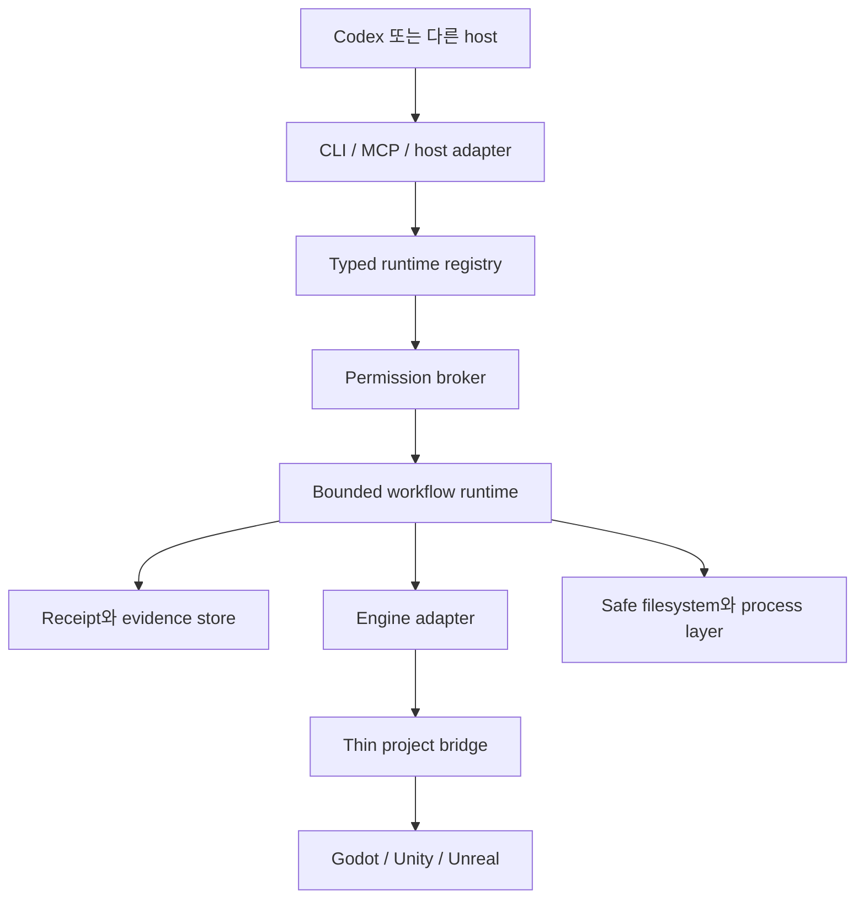

# 목표 아키텍처

> 상태: 일부 control plane이 구현된 목표 아키텍처입니다. Contract, runtime registry, core 안전 primitive, durable private receipt record와 artifact object, bounded private receipt-head query, pure process/test result normalization, 제한된 retained-artifact assessment, managed-pack transaction, plan-only `agpb init`, read-only `agpb doctor`, static read-only `agpb project inspect`, project-bound read-only STDIO MCP runtime, registry-derived project-inspection skill artifact, write-free Codex setup planner가 존재합니다. General mutation dispatch, evidence export, 실제 host installation, engine, bridge는 계획 단계입니다.

[English](architecture.md) · [문서](README.ko.md)

## 개요

저장소는 Node.js/TypeScript control plane용 pnpm workspace를 사용합니다. 엔진별 bridge는 Unity의 C#, Unreal의 Python/C++, Godot의 GDScript로 얇게 유지할 계획입니다. 그 외 Python은 격리된 Blender 또는 ML workload에만 도입합니다.

Typed registry는 command, skill, role lens, workflow, schema, pack descriptor의 authoring source입니다. Generation은 같은 validated identity에서 CLI, MCP, 문서, skill-routing metadata를 만듭니다. Runtime registry에는 현재 `init`, `doctor`, `project.inspect`가 있으며 CLI help, parsing, input/output validation, dispatch가 그 exact descriptor를 사용합니다. 실험적 MCP runtime은 같은 generated MCP metadata와 exact schema에서 명시적으로 선택한 read-only subset만 등록합니다. 공개 foundation plan은 runtime-registry digest를 기록하고 미구현 command를 분리합니다.

## Workspace 경계

| 경계 | 상태 | 책임 |
| --- | --- | --- |
| `contracts` | 기반 구현 | Versioned schema, canonical data, identifier, approval, workflow, engine, evidence, init-plan, doctor, project-inspection protocol |
| `registry` | 기반 구현 | Descriptor validation, generation, digest, routing, workflow-plan resolution, exact implemented-command inventory |
| `core` | 일부 구현 | Canonical project identity, safe path, compare-and-swap filesystem operation, bounded process, mutation lease, in-memory permission admission, workflow state, durable checkpoint, append-only run receipt, bounded receipt-head query, private artifact promotion |
| `pack-runtime` | 일부 구현 | Write-free preflight, exact ownership, local lifecycle transaction, journal, active barrier, rollback, directory ownership, recovery inspection, approved stable-state finalization |
| `cli` | 실험적 일부 구현 | Registry-derived help/version, fail-closed parsing, stable exit category, human/JSON output, plan-only `init`, read-only `doctor`, static `project inspect` |
| `evidence` | Private 기반 일부 구현 | Pure bounded-process/structured-test normalization, 제한된 retained-artifact format/provenance assessment, canonical receipt record, content-addressed byte, producer-bound manifest가 존재하며 engine report parsing, assessment persistence, retention, migration, CLI/MCP listing, explicit export는 계획 단계 |
| `mcp` | 실험적 private runtime | Explicit generated read-only tool allowlist, exact project binding, schema parity, bounded message, canonical result를 제공하는 modern STDIO transport. Mutation/network tool은 사용할 수 없음 |
| `codex-adapter` | Private planner 일부 구현 | Write, merge, trust 변경, skill materialization 없이 deterministic local-only project MCP configuration과 project-inspection skill target 계획 및 create/retain/conflict 검사 |
| `engine-common` | Contract만 존재 | 공통 capability negotiation과 engine-operation contract |
| Engine adapter | 계획 | Broad host authority 없는 Godot, Unity, Unreal orchestration |
| Project bridge | 계획 | Verified operation 노출에 필요한 최소 Editor/runtime code |

Partial package가 존재한다고 전체 product surface가 존재하는 것은 아닙니다. 현재 어떤 package도 Editor를 제어하거나 live engine frame을 검증하지 않습니다.

## 현재 write-free 실행 흐름

구현된 CLI 경로는 의도적으로 좁습니다.

1. Global help/version 또는 exact `init`, `doctor`, `project inspect` command와 선언된 flag만 parse합니다.
2. Validated runtime registry에서 선택한 command descriptor를 얻습니다.
3. Descriptor 결합 input schema로 request를 검증합니다.
4. `init`은 canonical root 하나를 bind하고 고정된 target 16개를 write 없이 분류합니다. `doctor`는 registry parity, Node.js version, project identity, fixed state directory, installed-pack state, active transaction marker를 write 없이 검사합니다. `project inspect`는 root를 deterministic하게 열거하고 선택한 marker path를 bound root로 resolve하며 stable identity를 통해 bounded marker/profile file을 두 번 읽고 external execution 없이 dirty/process gap을 보존합니다.
5. Bounded target/check outcome에서 plan 또는 diagnostic status를 계산합니다.
6. 해당되는 semantic count, identity, digest binding을 검증한 뒤 완성된 report를 descriptor 결합 output schema로 검증합니다.
7. Human 또는 canonical JSON output을 만들고 stable exit category로 매핑합니다.

Handler digest는 compiled init, doctor, project-inspection module을 각각 attest합니다. 어느 executable artifact든 registry metadata와 drift하면 cross-package test가 실패합니다.

현재 MCP 경로도 write-free입니다. Startup에는 project root 하나, 명시적인 generated tool name 하나 이상, 선택한 project diagnostic이 active host context에 들어갈 수 있다는 acknowledgement가 필요합니다. Runtime은 canonical project identity를 bind하고 read-only closed-world tool만 등록하며 STDIO message 하나를 1 MiB로 제한하고 exact registered input/output schema를 검증한 뒤 canonical bounded result를 반환합니다. HTTP transport, network access, Editor control, mutation route는 없습니다.

Codex adapter는 caller가 선택한 runtime code를 받지 않고 현재 지원 Node.js executable과 이 installation의 MCP entry point를 자체 결정합니다. Project-local `.codex/config.toml` 하나와 `.agents/skills/project-inspection/SKILL.md` target 하나의 immutable byte를 만들고 project/runtime identity를 다시 확인하면서 각 target을 create, retain, conflict로 분류합니다. Packaged skill source는 bounded canonical regular file이어야 하며 UTF-8, LF-only frontmatter, name, SHA-256 digest가 generated registry route와 일치해야 합니다. Adapter는 parent directory를 만들거나 target을 write/merge하거나 project trust를 변경하거나 skill을 설치하지 않습니다.

## 계획된 mutation 실행 흐름

General flow는 아직 executable CLI path가 아닌 목표입니다.

1. Project를 detect하고 exact `GameProjectProfile`을 만듭니다.
2. `EngineCapabilityReport`를 negotiate하고 unsupported operation의 reason과 evidence gap을 유지합니다.
3. `FeatureContract`, permission class, budget, owned path, expected dirty state를 검증합니다.
4. Current registry와 project stage에 대해 finite workflow plan을 resolve하고 attest합니다.
5. Project mutation lane 하나를 얻고 필요하면 exact Editor session 하나를 bind합니다.
6. Bounded output, timeout, cancellation, mutation 기본 재시도 금지 조건으로 registered command를 실행합니다.
7. State transition, receipt, evidence를 영속화합니다.
8. Reload, restart, failure, rollback 뒤 identity와 dirty state를 reconcile합니다.

Unknown mutation state는 `uncertain`으로 가며 곧바로 execution으로 돌아갈 수 없습니다.

## 소비자 project state

소비자 game project에는 `.ai-game-playbook/`을 둘 계획입니다. Portable profile, feature contract, policy, pack lock은 commit 대상입니다. Cache, log, screenshot, local receipt, lock, secret, machine-specific config는 ignore합니다.

Plan-only `init`은 committed metadata intent와 local-only runtime intent에 걸친 고정 target 16개를 보고합니다. Profile/policy byte를 제공하거나 mutation primitive를 호출하지 않습니다. 구현된 private bootstrap은 receipt, artifact object, artifact manifest directory를 포함한 고정 runtime directory 11개만 만들 수 있습니다. Idempotent하고 link와 case alias를 거부하며 parent/target identity를 검증하고 명확히 실패한 call이 만든 directory만 제거합니다. `doctor`는 이 layout을 읽지만 bootstrap을 호출하지 않습니다. `project inspect`는 fixed committed profile path를 검증할 수 있지만 profile data를 생성, repair, promote할 수 없습니다.

Private receipt와 artifact store는 해당 고정 local directory가 이미 존재해야 동작합니다. Artifact promotion은 complete project-local source마다 stable snapshot을 digest-addressed immutable object로 저장합니다. Promoted receipt는 각 canonical manifest digest와 원본 source path를 직접 증명하고, 각 manifest는 보존 object와 source를 receipt 실행 context, project/runtime identity, registry, command descriptor, handler에 결합합니다. Receipt persistence는 같은 authority를 compare-and-swap run head 뒤의 canonical immutable record에 결합합니다. Reload는 제한된 predecessor chain을 검증하고 선언한 byte budget 안에서 각 complete artifact object와 manifest를 두 번 다시 엽니다. 승격 뒤 원본 source가 바뀌어도 보존된 evidence는 변하지 않습니다. 별도 bounded query는 frozen summary를 반환하기 전에 fixed-directory entry 전체, 각 canonical head, latest-record 존재를 검증합니다. 상세 load는 원본 same-process query witness를 요구하고 full-chain verifier를 재사용하므로 summary는 receipt나 artifact proof가 되지 않습니다. Corrupt, relocated, rebound, competing state는 보존한 채 거부합니다. Store 자체는 format/decode QA, retention cleanup, evidence CLI operation, export, historical-registry migration을 수행하지 않습니다.

Private evidence package는 이미 bounded된 process observation과 이미 구조화된 test-report observation을 immutable component outcome으로 바꿉니다. Process identity, timing, output counter, termination invariant를 다시 검증하고 cancellation과 termination uncertainty를 보존하며 normalized result에 raw stdout/stderr를 복사하지 않습니다. Test normalization은 unavailable/inconsistent report, zero discovered test, all-skipped execution, assertion failure, missing required test ID, passing report 뒤 process failure를 구분합니다. 별도 assessor는 promoted complete artifact 하나를 읽기 전후에 검증하고 최대 16 MiB의 UTF-8, exact canonical JSON 또는 non-interlaced PNG inspection을 수행합니다. 선택적 `AssetProvenance` assessment는 exact current in-process registry를 사용하며 current-file path, digest, byte count가 artifact와 일치해야 합니다. Interlaced PNG는 `unverified`로 degrade하고 raw content를 반환하지 않습니다. Assessment는 receipt나 sidecar에 기록되지 않으며 runtime-frame origin, engine import quality, production readiness를 확립할 수 없습니다. 이 package는 process 실행, engine report parsing, required test discovery, receipt persistence, engine 검증을 수행하지 않습니다.

Pack preflight는 validated registry, source/target root identity, local artifact byte, installed-state digest, intended change, conflict, limit을 same-process immutable plan에 결합합니다. Execution에는 exact `install` authorization과 attest된 project-write lease가 추가로 필요합니다. Canonical installed state는 마지막에 commit합니다. 명확한 실패는 이미 commit한 file을 역순 rollback하며 uncertain effect는 재시도하지 않습니다.

Active marker와 append-only journal이 interruption state를 보존합니다. Read-only recovery inspector는 bounded observation을 두 번 수행합니다. 별도 finalizer는 fresh exact approval과 lane을 요구하고 각 closure boundary 전에 다시 검사하며 attest된 stable state만 닫을 수 있고 artifact를 repair하거나 mixed state를 해결하지 않습니다. `doctor`는 malformed installed state나 marker 존재만 보고하며 recovery path를 호출하지 않습니다.

## Identity와 execution lane

Runtime authority는 project root identity, project profile digest, feature contract digest, process executable/start identity, Editor session nonce, scene/world identity, registry digest, handler digest, 관련 pack digest를 결합할 계획입니다. PID, port, process name, window title 하나만으로는 충분하지 않습니다.

Execution lane은 다음과 같습니다.

- bounded immutable inspection용 `parallel-read`;
- project source와 managed metadata용 `project-write`;
- project serialization 안의 exact Editor session용 `editor-bound`;
- approved test/build work용 `build-bound`.

현재 `init`, `doctor`, `project inspect` descriptor는 `parallel-read`를 선언하지만 general parallel-reader coordination은 아직 구현하지 않았습니다. Mutation lane은 project마다 lease 하나이며 명시적 renew가 필요합니다.

## Engine adapter 경계

공통 목표 contract는 `detect → negotiate → inspect → mutate → save → compile/import → test → play → deterministic input → logs → capture → profile → build/export → rollback`입니다.

각 adapter는 offline inspection, headless execution, Editor preview, actual play, packaged runtime evidence를 구분해야 합니다. Thin bridge는 typed bounded operation만 받습니다. Exact project/session을 인증하고 request/output size를 제한하며 outer transport와 inner operation outcome을 모두 보고하고 changed object/file, save/import state, log, evidence locator를 반환해야 합니다.

Godot이 첫 계획 adapter이고 Unity, Unreal이 뒤따릅니다. 세 엔진의 현재 support grade는 모두 `planned`입니다.

## Degradation과 support claim

Capability grade는 `planned`, `detected`, `headless`, `editor-preview`, `verified`입니다. Command availability는 engine capability grade를 높이지 않습니다. Missing tool, ambiguous instance, unavailable live Editor, absent test, incomplete capture, unknown performance environment는 explicit degradation 또는 unverified outcome을 만들어야 합니다.

Windows x64가 첫 build target입니다. Linux는 초기 static/headless control-plane CI target입니다. macOS, mobile, console, XR, multiplayer, browser-first game은 첫 alpha 범위 밖입니다.
