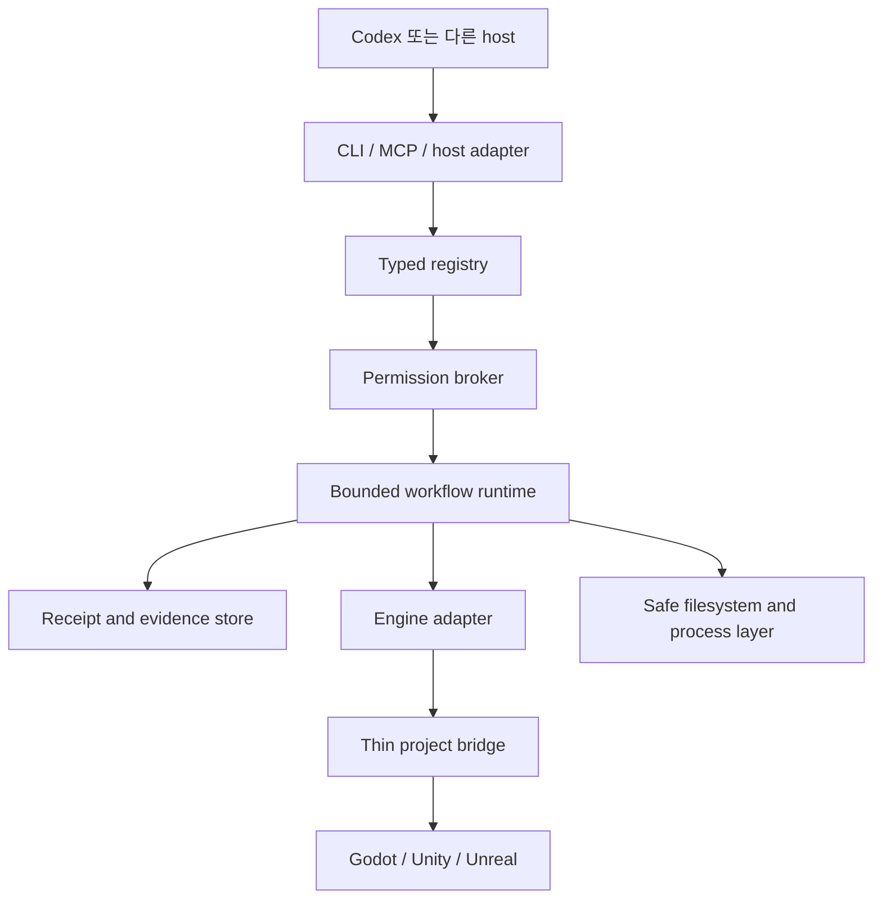

# 목표 아키텍처

> 상태: 목표 아키텍처입니다. `contracts`, `registry` 기반과 초기 `core` filesystem/process/mutating-lane/permission-admission 경계가 존재하며 나머지 runtime과 bridge 경계는 계획 단계입니다.

[English](architecture.md) · [문서](README.ko.md)

## 개요

저장소는 Node.js/TypeScript control plane용 pnpm workspace를 사용합니다. 엔진별 bridge는 Unity의 C#, Unreal의 Python/C++, Godot의 GDScript로 얇게 유지할 계획입니다. 그 외 Python은 격리된 Blender 또는 ML workload에만 도입합니다.

typed registry는 command, skill, role lens, workflow, schema, pack descriptor의 작성 원본입니다. 현재 generator는 CLI, MCP, help, 문서 metadata, host routing용으로 검증된 설계 projection을 생성합니다. 또한 지원되는 workflow stage를 exact registry, workflow, schema, command, handler, lane, permission, budget, failure transition, evidence duty에 결합된 유한하고 domain-separated된 plan으로 해석합니다. private permission primitive는 검증된 command와 schema authority를 소비하지만 생성된 CLI/MCP/host 실행 consumer와 workflow state machine은 아직 계획 단계입니다. 생성 표면은 권한을 부여하거나 capability를 지어낼 수 없습니다.

## Workspace 경계

| 경계 | 상태 | 책임 |
| --- | --- | --- |
| `contracts` | 기반 구현 | engine runtime dependency가 없는 versioned schema와 shared identifier |
| `registry` | 기반 구현 | descriptor validation, generation, digest, routing, parity check, 결정적 workflow-plan 해석 |
| `core` | 일부 구현 | canonical project identity, portable path 해석, staged filesystem compare-and-swap, digest 결합 direct process 실행, root/project 결합 mutating lease, in-memory signed permission admission/settlement가 존재하며 dispatcher integration, durable approval, CPU/memory enforcement, parallel-read coordination, checkpoint, workflow state는 계획 단계 |
| `cli` | 계획 | `agpb` argument parsing, local interaction, stable exit behavior, help |
| `mcp` | 계획 | 동일 permission broker 뒤의 schema-derived tool과 resource |
| `codex-adapter` | 계획 | skill, host routing metadata, project instruction integration |
| `pack-runtime` | 계획 | staged install, owned path, dependency check, update, rollback, uninstall |
| `evidence` | 계획 | content-addressed artifact, receipt, export, retention, redaction |
| `engine-common` | 계약만 구현 | 공통 capability negotiation과 engine operation contract |
| Engine adapter | 계획 | 넓은 host 권한 없이 Godot, Unity, Unreal orchestration |
| Project bridge | 계획 | 검증된 engine operation 노출에 필요한 최소 Editor/runtime code |

현재 workspace package로 존재하는 경계는 `contracts`, `registry`, 일부 구현된 private `core`입니다. 표에 있다는 사실만으로 runtime package나 capability가 존재한다고 주장하지 않습니다.

## 실행 흐름

1. project를 탐지하고 exact `GameProjectProfile`을 만듭니다.
2. `EngineCapabilityReport`를 협상하며 지원하지 않는 operation은 reason과 fallback grade를 유지합니다.
3. `FeatureContract`, permission class, budget, owned path, expected dirty state를 검증합니다.
4. 현재 registry와 project stage에 대해 유한한 workflow plan을 해석하고 attest합니다.
5. project lane을 획득하고 필요하면 Editor session 하나를 결합합니다.
6. bounded output, timeout, cancellation, mutation 기본 retry 없음 조건으로 registry command를 실행합니다.
7. artifact와 state transition을 hash-linked `RunReceipt`에 저장합니다.
8. reload, restart, failure, rollback 뒤 identity와 dirty state를 reconcile합니다.

## 소비자 project 상태

게임 project에는 `.ai-game-playbook/`을 둘 계획입니다. project profile, feature contract, policy는 commit 대상입니다. cache, log, screenshot, lock, local detail을 포함한 receipt, local secret, machine-specific configuration은 ignore합니다.

write는 owned-path rule과 compare-and-swap preimage를 사용합니다. registry는 실행 전에 immutable workflow plan을 파생하고 의미 검증할 수 있지만 현재 이를 진행하거나 checkpoint에 결합하는 runtime은 없습니다. 현재 private core는 고정된 project-local lease 하나로 `project-write`, `editor-bound`, `build-bound` admission을 직렬화하지만 아직 Editor를 탐지하거나 제어하지는 않습니다. permission primitive는 검증된 registry에서 command를 resolve하고 실제 input schema를 검증하며 feature/workflow/session scope와 budget을 좁히고 exact signed grant를 memory에서 소비하며 보고된 undeclared effect를 거부합니다. 아직 lane 획득이나 command dispatch와 연결되지 않았고 approval consumption과 uncertainty barrier는 process restart를 넘어 보존되지 않습니다. pack lifecycle operation과 parallel read coordination도 계획 단계입니다.

## Host integration

Codex가 첫 지원 host지만 계약은 하나의 chat surface에 의존하지 않습니다. project instruction은 directory scope를 따르고 skill은 점진적으로 load하며 MCP는 필요에 따라 local process 또는 streamable HTTP transport를 사용합니다. host annotation은 advisory이고 control plane permission broker가 권한의 기준입니다.

## 실패와 복구

모든 mutation은 precondition, changed path, engine identity, recovery status를 기록하도록 계획합니다. 구현된 lease는 root/project mismatch, lock directory identity 변경, malformed record, live 또는 확인 불가능한 owner에서 중단합니다. 만료된 lease는 owner PID가 더는 실행 중이지 않을 때만 quarantine합니다. durable recovery receipt와 전체 workflow reconciliation은 아직 계획 단계입니다. rollback은 실패한 command가 아무것도 바꾸지 않았다고 가정하는 대신 자체 receipt를 갖는 등록 operation입니다.
