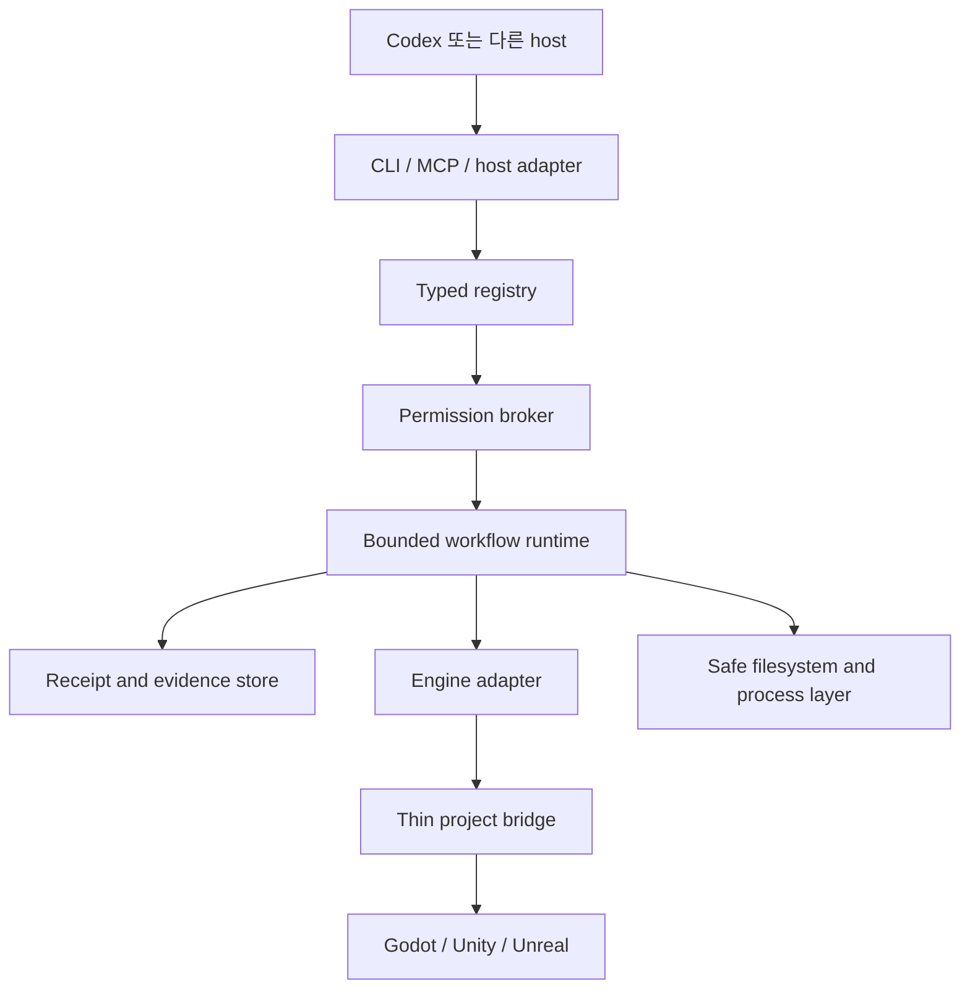

# 목표 아키텍처

> 상태: 계획된 아키텍처입니다. 검토 중 package와 bridge 경계가 바뀔 수 있습니다.

[English](architecture.md) · [문서](README.ko.md)

## 개요

계획된 시스템은 pnpm workspace와 Node.js/TypeScript control plane을 사용합니다. 엔진별 bridge는 Unity의 C#, Unreal의 Python/C++, Godot의 GDScript로 얇게 유지합니다. 그 외 Python은 격리된 Blender 또는 ML workload에만 도입합니다.

typed registry는 command, skill, role-lens, workflow descriptor를 작성하는 유일한 계획 원본입니다. CLI parsing, MCP schema, help, public command metadata, Codex routing은 생성 projection입니다. 생성 표면은 권한을 부여하거나 capability를 지어낼 수 없습니다.

## 계획된 workspace 경계

| 경계 | 책임 |
| --- | --- |
| `contracts` | engine runtime dependency가 없는 versioned schema와 shared identifier |
| `registry` | descriptor validation, generation, digest, parity check |
| `core` | project identity, permission, budget, lane, checkpoint, workflow state |
| `cli` | `agpb` argument parsing, local interaction, stable exit behavior, help |
| `mcp` | 동일 permission broker 뒤의 schema-derived tool과 resource |
| `codex-adapter` | skill, host routing metadata, project instruction integration |
| `pack-runtime` | staged install, owned path, dependency check, update, rollback, uninstall |
| `evidence` | content-addressed artifact, receipt, export, retention, redaction |
| `engine-common` | 공통 capability negotiation과 engine operation contract |
| Engine adapter | 넓은 host 권한 없이 Godot, Unity, Unreal orchestration |
| Project bridge | 검증된 engine operation 노출에 필요한 최소 Editor/runtime code |

이는 논리적 경계 계획이며 정확히 이 package 이름이 이미 존재한다는 뜻이 아닙니다.

## 실행 흐름

1. project를 탐지하고 exact `GameProjectProfile`을 만듭니다.
2. `EngineCapabilityReport`를 협상하며 지원하지 않는 operation은 reason과 fallback grade를 유지합니다.
3. `FeatureContract`, permission class, budget, owned path, expected dirty state를 검증합니다.
4. project lane을 획득하고 필요하면 Editor session 하나를 결합합니다.
5. bounded output, timeout, cancellation, mutation 기본 retry 없음 조건으로 registry command를 실행합니다.
6. artifact와 state transition을 hash-linked `RunReceipt`에 저장합니다.
7. reload, restart, failure, rollback 뒤 identity와 dirty state를 reconcile합니다.

## 소비자 project 상태

게임 project에는 `.ai-game-playbook/`을 둘 계획입니다. project profile, feature contract, policy는 commit 대상입니다. cache, log, screenshot, lock, local detail을 포함한 receipt, local secret, machine-specific configuration은 ignore합니다.

write는 owned-path rule과 compare-and-swap preimage를 사용합니다. pack lifecycle operation은 promote 전에 change를 stage하고 non-owned file을 삭제하지 않습니다. Editor-bound work는 project별로 직렬화하고 read-only inspect는 병렬 실행할 수 있습니다.

## Host integration

Codex가 첫 지원 host지만 계약은 하나의 chat surface에 의존하지 않습니다. project instruction은 directory scope를 따르고 skill은 점진적으로 load하며 MCP는 필요에 따라 local process 또는 streamable HTTP transport를 사용합니다. host annotation은 advisory이고 control plane permission broker가 권한의 기준입니다.

## 실패와 복구

모든 mutation은 precondition, changed path, engine identity, recovery status를 기록합니다. stale process, changed session, path escape, unexpected dirty file, incomplete result, exceeded budget이 있으면 workflow를 중단합니다. rollback은 실패한 command가 아무것도 바꾸지 않았다고 가정하는 대신 자체 receipt를 갖는 등록 operation입니다.
