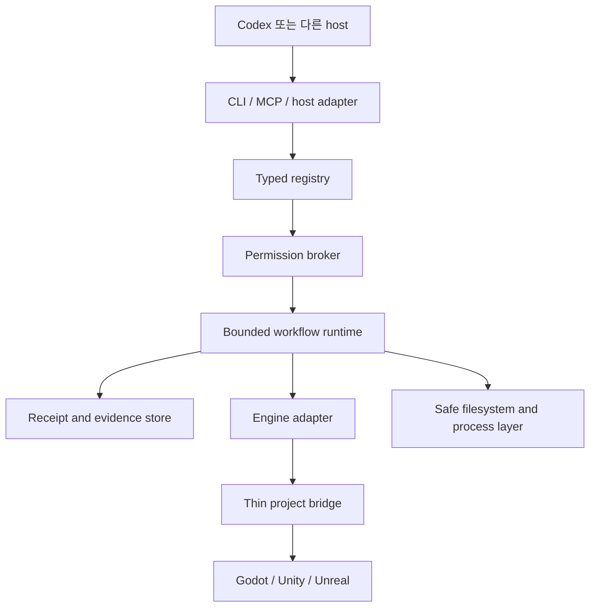

# 목표 아키텍처

> 상태: 목표 아키텍처입니다. `contracts`, `registry` 기반, 초기 `core` 안전 경계와 private managed-pack transaction runtime이 존재하며 나머지 runtime과 bridge 경계는 계획 단계입니다.

[English](architecture.md) · [문서](README.ko.md)

## 개요

저장소는 Node.js/TypeScript control plane용 pnpm workspace를 사용합니다. 엔진별 bridge는 Unity의 C#, Unreal의 Python/C++, Godot의 GDScript로 얇게 유지할 계획입니다. 그 외 Python은 격리된 Blender 또는 ML workload에만 도입합니다.

typed registry는 command, skill, role lens, workflow, schema, pack descriptor의 작성 원본입니다. 현재 generator는 CLI, MCP, help, 문서 metadata, host routing용으로 검증된 설계 projection을 생성합니다. 또한 지원되는 workflow stage를 exact registry, workflow, schema, command, handler, lane, permission, budget, failure transition, evidence duty에 결합된 유한하고 domain-separated된 plan으로 해석합니다. private permission과 workflow-state primitive는 검증된 authority를 소비하고 현재 checkpoint store는 제한된 state transition을 영속화합니다. 생성된 CLI/MCP/host 실행 consumer와 durable approval, receipt, evidence store는 아직 계획 단계입니다. 생성 표면은 권한을 부여하거나 capability를 지어낼 수 없습니다.

## Workspace 경계

| 경계 | 상태 | 책임 |
| --- | --- | --- |
| `contracts` | 기반 구현 | engine runtime dependency가 없는 versioned schema와 shared identifier |
| `registry` | 기반 구현 | descriptor validation, generation, digest, routing, parity check, 결정적 workflow-plan 해석 |
| `core` | 일부 구현 | canonical project identity, 고정 레이아웃 project-state bootstrap, portable path 해석, staged filesystem compare-and-swap, digest 결합 direct process 실행, root/project 결합 mutating lease, in-memory signed permission admission/settlement, immutable workflow checkpoint transition, append-only checkpoint 영속화, 제한된 chain 검증, restart-safe recovery 분류가 존재하며 dispatcher integration, durable approval/receipt/evidence, uncertainty reconciliation, CPU/memory enforcement, parallel-read coordination은 계획 단계 |
| `cli` | 계획 | `agpb` argument parsing, local interaction, stable exit behavior, help |
| `mcp` | 계획 | 동일 permission broker 뒤의 schema-derived tool과 resource |
| `codex-adapter` | 계획 | skill, host routing metadata, project instruction integration |
| `pack-runtime` | 일부 구현 | write-free validated-registry preflight, broker/lane 결합 local add, update, installed-state 소유권 기반 remove, CAS promotion, 명확한 실패의 rollback, effect settlement, active-transaction barrier, append-only journal 검증, 제한된 read-only recovery 분류, 별도 승인된 stable-state finalization이 존재하며 pack 소유 artifact directory lifecycle, CLI/doctor 통합, 분산 pack 획득은 계획 단계 |
| `evidence` | 계획 | content-addressed artifact, receipt, export, retention, redaction |
| `engine-common` | 계약만 구현 | 공통 capability negotiation과 engine operation contract |
| Engine adapter | 계획 | 넓은 host 권한 없이 Godot, Unity, Unreal orchestration |
| Project bridge | 계획 | 검증된 engine operation 노출에 필요한 최소 Editor/runtime code |

현재 workspace package로 존재하는 경계는 `contracts`, `registry`, 일부 구현된 private `core`, private `pack-runtime`입니다. 표에 있다는 사실만으로 완전한 runtime capability가 존재한다고 주장하지 않습니다.

## 실행 흐름

1. project를 탐지하고 exact `GameProjectProfile`을 만듭니다.
2. `EngineCapabilityReport`를 협상하며 지원하지 않는 operation은 reason과 fallback grade를 유지합니다.
3. `FeatureContract`, permission class, budget, owned path, expected dirty state를 검증합니다.
4. 현재 registry와 project stage에 대해 유한한 workflow plan을 해석하고 attest합니다.
5. project lane을 획득하고 필요하면 Editor session 하나를 결합합니다.
6. bounded output, timeout, cancellation, mutation 기본 retry 없음 조건으로 registry command를 실행합니다.
7. artifact와 state transition을 hash-linked `RunReceipt`에 저장합니다.
8. reload, restart, failure, rollback 뒤 identity와 dirty state를 reconcile합니다.

## 소비자 project 상태

게임 project에는 `.ai-game-playbook/`을 둘 계획입니다. project profile, feature contract, policy는 commit 대상입니다. cache, log, screenshot, lock, local detail을 포함한 receipt, local secret, machine-specific configuration은 ignore합니다.

write는 owned-path rule과 compare-and-swap preimage를 사용합니다. private core는 구현된 primitive가 사용하는 고정 lock, workflow state, pack state, transaction directory만 초기화할 수 있습니다. 초기화는 재실행해도 안전하고 link와 대소문자 alias를 거부하며 parent와 target identity를 확인하고 실패한 호출이 직접 생성한 directory만 rollback합니다. 정리가 모호하면 mutation-uncertain으로 보고합니다. core는 또한 resolved workflow를 pre-dispatch, dispatched, settled, rollback, blocked, terminal, uncertain checkpoint로 진행합니다. 각 transition은 exact plan을 다시 해석하고 같은 process에서 발급된 permission authority만 받으며 domain-separated receipt를 command와 authorization identity에 결합하고 receipt chain, 누적 workflow budget, complete evidence를 보존합니다. canonical checkpoint record는 고정된 project-local directory에 append-only로 저장하고 compare-and-swap head가 현재 chain을 선택합니다. load는 record 수와 byte를 제한하고 모든 parent transition과 현재 registry/project identity를 다시 검사하며 손상된 state를 진단용으로 보존하고 경쟁 head를 거부합니다. restart recovery는 dispatch하지 않은 admission을 재승인 상태로 되돌리고 dispatch했지만 정산하지 못한 step을 `uncertain`으로 바꿉니다. pack preflight는 같은 process에서 검증한 registry, target/source root identity, local artifact byte, installed-state digest, 의도한 file change, conflict, limit를 immutable write-free plan으로 결합합니다. private executor는 exact broker-issued install authorization과 same-process `project-write` lease를 요구합니다. 기대 started record 전체를 담은 canonical active marker를 쓴 뒤 final-file effect 전에 해당 started record를 영속화하고, artifact와 installed-state CAS operation을 stage하며 terminal outcome과 실제 effect settlement를 기록합니다. 불확실하지 않은 terminal에만 marker를 exact digest로 지웁니다. marker가 남아 있거나 malformed이면 이후 모든 pack plan을 중단합니다. read-only inspector는 marker와 journal을 다시 검증하고 선언된 모든 artifact와 installed state를 제한된 snapshot으로 두 번 관찰해 preimage, postimage, mixed, terminal contradiction 또는 unstable state를 보고합니다. 이 report 자체에는 mutation 권한이 없습니다.

안정적이고 일치하는 report 하나에 대해서만 private recovery finalizer가 exact internal registry descriptor에서 같은 process의 digest 결합 plan을 파생합니다. broker가 별도로 발급한 `install` 승인과 같은 transaction의 attest된 `project-write` lease를 요구합니다. 해당 권한 아래에서 report 전체를 다시 검사하고 필요한 경우 누락된 started/terminal closure 또는 sequence-2 reconciliation record만 append하며 exact marker를 지우기 전에 결과 journal과 preimage/postimage를 확인하고 해제 뒤 다시 검증합니다. 해제 뒤 검증이 실패하면 안전 barrier인 exact marker 복원을 시도합니다. pack artifact를 repair·retry·rollback하지 않으며 stale 또는 ambiguous report는 forward write 없이 정산합니다. 일반 실행 중 뒤 파일의 명확한 실패는 제한된 역순 rollback을 수행하고 uncertain effect는 재시도하지 않습니다. pack이 현재 registry에서 사라져도 canonical installed ownership을 사용해 remove할 수 있습니다. executor에는 여전히 미리 만든 pack artifact parent directory가 필요합니다. 어느 pack 경로에도 CLI, doctor command, approval UI, durable approval capability, durable recovery receipt가 없습니다. 일반 workflow state machine은 command dispatch에 아직 연결되지 않았고 전체 receipt와 evidence payload도 영속화하지 않습니다. core는 아직 Editor를 탐지하거나 제어하지 않으며 parallel-read coordination도 계획 단계입니다.

## Host integration

Codex가 첫 지원 host지만 계약은 하나의 chat surface에 의존하지 않습니다. project instruction은 directory scope를 따르고 skill은 점진적으로 load하며 MCP는 필요에 따라 local process 또는 streamable HTTP transport를 사용합니다. host annotation은 advisory이고 control plane permission broker가 권한의 기준입니다.

## 실패와 복구

모든 mutation은 precondition, changed path, engine identity, recovery status를 기록하도록 계획합니다. 구현된 lease는 root/project mismatch, lock directory identity 변경, malformed record, live 또는 확인 불가능한 owner에서 중단합니다. 만료된 lease는 owner PID가 더는 실행 중이지 않을 때만 quarantine합니다. pack 전용 finalizer는 위에서 설명한 exact stable preimage 또는 postimage만 닫을 수 있으며 workflow나 engine recovery로 일반화되지 않습니다. workflow 경계는 uncertain mutation이나 누적 budget 위반을 영속적으로 보존하고 선언된 rollback을 별도 command와 receipt로 승인합니다. restart recovery를 분류할 수 있지만 일반 workflow uncertainty를 reconcile하거나 해제하고 project/Editor state를 복원하거나 rollback을 직접 dispatch하지는 못합니다. rollback은 실패한 command가 아무것도 바꾸지 않았음을 뜻하지 않습니다.
