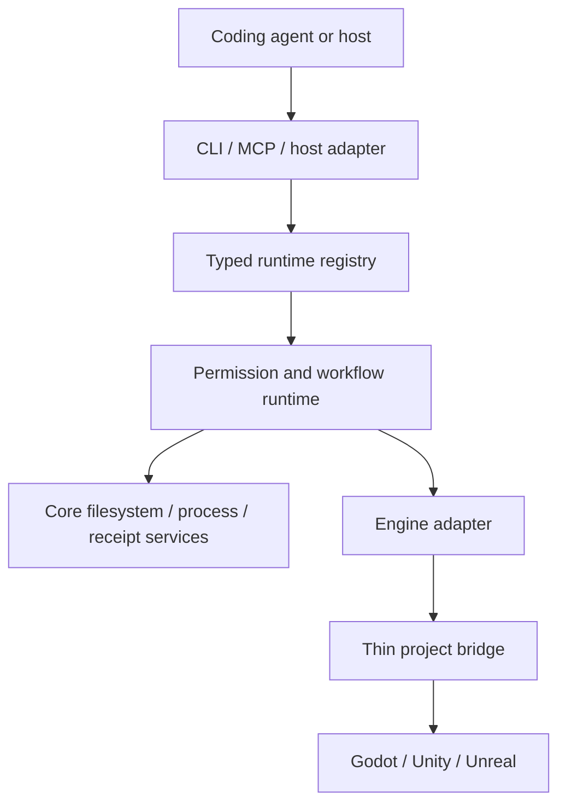

# Architecture

> Status: the Node.js/TypeScript control-plane foundation and a private Windows x64 contained-process path are source-built. Public engine mutation, live bridges, and evidence export are not implemented.

[한국어](architecture.ko.md) · [Documentation](README.md)

## System shape

The control plane keeps engine-specific code thin and puts shared identity, permission, workflow, and evidence rules in one place.

The workspace uses Node.js and TypeScript for the shared control plane. Planned bridges use GDScript for Godot, C# for Unity, and Python or C++ for Unreal. Python is otherwise reserved for isolated Blender or machine-learning work.

## Source of truth

One validated registry owns command, skill, workflow, schema, and pack identity. CLI help, dispatch metadata, MCP tool schemas, documentation status, and skill routes derive from that registry.

A generated surface is descriptive until a matching handler and runtime boundary exist. Unregistered commands are rejected, and internal commands are excluded from public CLI and MCP surfaces.

## Package boundaries

| Package | Responsibility today |
| --- | --- |
| `contracts` | Versioned schemas and semantic validation |
| `registry` | Descriptor validation, deterministic routing, generation, and digests |
| `core` | Project identity, safe paths, compare-and-swap writes, process bounds, permission, scoped in-memory approval signing, workflow, receipts, and artifact foundations |
| `engine-common` | Bounded path-free project and executable snapshots plus one-use private source handoff |
| `project-runtime` | Static project inspection and private initialization foundations |
| `pack-runtime` | Read-only pack inspection plus private ownership, transaction, durable dispatch, recovery, and evidence-reconciliation foundations |
| `skill-runtime` | Packaged skill validation, target inspection, and write-free managed-pack preflight |
| `evidence` | Process and test outcome normalization plus limited retained-artifact assessment |
| `cli` | Nine source-built plan-only, read-only, or static commands |
| `mcp` | Opt-in project-bound read-only STDIO tools selected from registry metadata |
| `codex-adapter` | Write-free project setup planning plus private one-shot approval for project initialization and managed-skill installation, with read-only recovery assessment |
| `godot-adapter` | Static public Godot reports plus private exact-version approval, contained startup, and receipt settlement |
| `windows-containment-provider` | Windows x64 artifact identity, disposable qualification, exact snapshot admission, staged AppContainer execution, and path-free reports |

Unity and Unreal adapters and all project bridges remain planned.

The Windows containment package derives its descriptor and local catalog digest from the exact packaged x64 artifact. A one-use self-test handle binds the artifact, descriptor, project identity digest, challenge, and deadline. The native test runs only disposable state and produces a short-lived same-process witness after every probe and cleanup check passes.

That witness can be claimed once by a private synthetic-launch API. Preparation creates fresh path-free project and executable snapshots and binds a fixed invocation, deterministic output, process count, time, output, and termination budgets. The native host copies the already verified artifact into a disposable read-only fixture, runs only its built-in workload in a zero-capability AppContainer and one-process Job Object, checks both snapshots again, and removes the profile and fixture. The internal workload checks its AppContainer token before reading or writing. Serialized values and copied handles have no authority.

After synthetic qualification, a second internal boundary can consume the successful launch witness once and bind it to an exact read-only engine project manifest, exact executable content and identity, operation, invocation, provider digests, and a deadline of at most 30 seconds. The project scan rejects links and portable path collisions, enforces file, directory, and byte budgets, and excludes only a fixed set of local-state directories. Its serialized contracts contain digests and counts, not paths. Creating or checking this admission starts no engine process.

The Godot adapter combines that admission with the original same-process exact-version report. A version mismatch stays blocked. An exact target match can produce one approval request and one-use private execution authority. Immediately before dispatch, the provider rechecks every identity, consumes the source handoff, copies the admitted manifest and executable into disposable private roots, and starts only the fixed headless main-scene invocation in a zero-capability AppContainer. Time, output, profile growth, and process count are bounded; source, staged baseline, termination, and cleanup observations determine success, failure, or uncertainty.

The adapter settles the permission lease and retains a `RunReceipt` for a returned process report. Public contracts and receipts contain identities, digests, counts, timing, and redacted diagnostics rather than source paths or log bodies. Success, process failure, staged mutation, output overflow, profile overflow, timeout, and child-process denial have been exercised with a purpose-built fixture. An installed Godot release and the graybox project have not been validated. The public provider catalog remains empty, so neither CLI nor MCP can dispatch this path and no support grade is promoted.

The registry binds all twelve packaged skills to one digest-bound experimental pack. An internal preflight evaluates an `add` operation against project identity, installed state, exact file digests, and direct skill-directory ownership. A separate private dispatcher can execute a fresh ready plan only with exact install approval and the project-write lane. It revalidates the plan before admission, uses compare-and-swap ownership and rollback, and retains workflow checkpoints, a run receipt, and content-addressed terminal transaction evidence. Copied, stale, cancelled, unapproved, or conflicted plans stop before managed mutation. No public command invokes this path.

A second internal dispatcher closes an actionable pack-recovery report under a separate recovery-run identity. The original transaction continues to identify its journal; the recovery run identifies approval, lane ownership, checkpoint, receipt, and evidence. Success is withheld unless the domain closure and all durable execution records agree. Incomplete evidence remains a nonterminal checkpoint for later reconciliation rather than an automatic retry.

A finite internal reconciliation path can now close that retained checkpoint when the pack journal already contains a complete, stable closure proof. It uses a new run, approval, and receipt; observes the exact target checkpoint head and target-receipt state again; and never invokes the original mutation. The target gains append-only reconciliation metadata without inventing an original attempt or rewriting its receipt chain. Version 1 accepts only a one-step, command-phase pack-recovery checkpoint. Multi-step workflows, rollback phases, engine processes, and editor mutations remain unsupported.

Approval presentation, signing, and final authorization remain separate boundaries. The core can import one caller-supplied canonical Ed25519 key into a same-process handle, derive its broker trust binding, and issue short, use-limited signer capabilities. A scoped-use helper closes a signer after its callback resolves or rejects, including when the callback retained or closed the handle itself. It performs no key-file I/O and provides no durable key store.

The private local host path derives signer expiry and use count from the exact approval session. Project initialization and managed-skill installation each bind their own session, prepared plan, project and run identity, and signing-key ID and fingerprint to one same-process operation handle. Approval is presented at most once. An approval immediately enters durable dispatch in the same call; denial, cancellation, expiry, copied handles, changed keys, concurrent calls, and repeat calls cannot reach mutation. A no-op uses neither approval nor mutation authority. The caller-owned key remains open, and the presenter receives neither the key nor the signer.

Initialization and skill installation remain separate operations: each has a fresh approval, run identity, checkpoint, receipt, and recovery boundary. A clean project can therefore initialize the fixed control layout first and install the managed skill pack through a second approval without creating an implicit composite transaction.

That private path also provides bounded read-only recovery inspection. Managed-skill recovery compares a stable transaction journal with current project state and rechecks its workflow head. Initialization recovery performs two exact-run assessments and rejects state drift between them. Neither path replays the original operation or finalizes recovery. No public CLI or MCP command invokes these dispatch or recovery boundaries.

The permission broker separates approval admission from execution duration. Explicit approvals may wait for at most five minutes, while the resulting authorization lease is still capped from authorization time by the registered execution budget and the request's absolute deadline. Automatic permission paths retain their original execution-only deadline bound.

## Current read path

1. Parse only a registered public command and its declared flags.
2. Load the exact descriptor and validate input against its schema.
3. Bind one canonical project root and inspect only bounded files or state.
4. Preserve missing, ambiguous, blocked, and unknown observations.
5. Validate the complete report against the descriptor output schema.
6. Render human or canonical JSON output and map the report to a stable exit code.

The MCP runtime uses the same command and schema identities. Startup binds one project and an explicit read-only tool allowlist. Message count, pending requests, input bytes, output bytes, deadlines, and cancellation settlement are bounded.

## Planned change path

A mutating workflow must add several boundaries that the public CLI does not yet expose:

1. bind the project profile and a `FeatureContract`;
2. negotiate an exact engine capability and session identity;
3. obtain narrow approval and acquire the project or editor lane;
4. resolve a finite workflow and persist an admission checkpoint;
5. revalidate identity immediately before each effect;
6. execute with output, time, file, byte, and repair-cycle budgets;
7. persist receipts and evidence, then reconcile or roll back.

An unknown effect moves the run to `uncertain`. It cannot return directly to execution. A supported provider may only terminalize it from separate, complete evidence; otherwise it remains blocked.

## Identity and lanes

Authority can include project root, profile, feature, registry, command, handler, executable, process start, editor session, scene or world, and pack digest. A transport token or serialized report is never sufficient by itself.

`parallel-read` permits independent bounded inspection. `project-write`, `editor-bound`, and `build-bound` serialize effects that could conflict. Editor mutation uses one lane per project, and an ambiguous instance stops the run.

## Engine adapters

All adapters follow the common lifecycle described in [Core concepts](concepts.md). Each adapter implements or explicitly rejects every operation in that lifecycle.

An adapter reports unsupported operations and the missing evidence. A thin project bridge may expose only the minimum functionality required for an admitted editor or runtime operation. It must fail closed on missing authentication, wrong project identity, stale session identity, schema mismatch, or uncertain mutation.

## Consumer project state

A future initialized game project uses `.ai-game-playbook/` for portable profiles, feature contracts, policies, and pack locks. Those files may be committed. Cache, local receipts, logs, captures, locks, secrets, and machine-specific configuration stay ignored. The same fixed initialization layout includes shared `.agents/skills` directories, but managed skill packs do not own those shared parents.

The current `agpb init` only reports the intended layout. A private one-shot host operation can create or retain the exact layout through approval, a project-write lane, compare-and-swap operations, rollback, checkpoints, and receipts, but no public command applies it.
