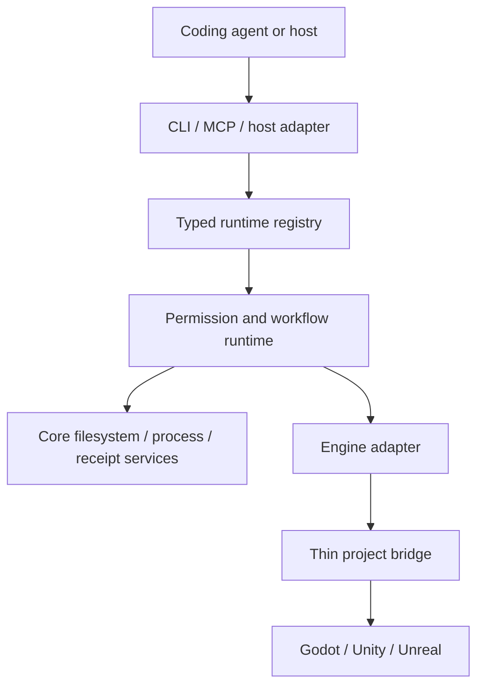

# Architecture

> Status: the Node.js/TypeScript control-plane foundation is partial. Public engine mutation, live bridges, and evidence export are not implemented.

[한국어](architecture.ko.md) · [Documentation](README.md)

## System shape

The control plane keeps engine-specific code thin and puts shared identity, permission, workflow, and evidence rules in one place.

The workspace uses Node.js and TypeScript for the shared control plane. Planned bridges use GDScript for Godot, C# for Unity, and Python or C++ for Unreal. Python is otherwise reserved for isolated Blender or machine-learning work.

## Source of truth

One validated registry owns command, skill, workflow, schema, and pack identity. CLI help, dispatch metadata, MCP tool schemas, documentation status, and skill routes derive from that registry.

A generated surface is descriptive until a matching handler and runtime boundary exist. Unregistered commands are rejected, and internal commands are excluded from public CLI and MCP surfaces.

## Package boundaries

| Package | Responsibility today |
| --- | --- |
| `contracts` | Versioned schemas and semantic validation |
| `registry` | Descriptor validation, deterministic routing, generation, and digests |
| `core` | Project identity, safe paths, compare-and-swap writes, process bounds, permission, workflow, receipts, and artifact foundations |
| `project-runtime` | Static project inspection and private initialization foundations |
| `pack-runtime` | Read-only pack inspection plus private ownership, transaction, durable dispatch, and recovery foundations |
| `skill-runtime` | Packaged skill validation, target inspection, and write-free managed-pack preflight |
| `evidence` | Process and test outcome normalization plus limited retained-artifact assessment |
| `cli` | Nine source-built plan-only, read-only, or static commands |
| `mcp` | Opt-in project-bound read-only STDIO tools selected from registry metadata |
| `codex-adapter` | Write-free project setup and skill target planning |
| `godot-adapter` | Static public Godot reports and private fail-closed host-tool preflight foundations |

Unity and Unreal adapters and all project bridges remain planned.

The registry binds all twelve packaged skills to one digest-bound experimental pack. An internal preflight evaluates an `add` operation against project identity, installed state, exact file digests, and direct skill-directory ownership. A separate private dispatcher can execute a fresh ready plan only with exact install approval and the project-write lane. It revalidates the plan before admission, uses compare-and-swap ownership and rollback, and retains workflow checkpoints, a run receipt, and content-addressed terminal transaction evidence. Copied, stale, cancelled, unapproved, or conflicted plans stop before managed mutation. No public command invokes this path.

A second internal dispatcher closes an actionable pack-recovery report under a separate recovery-run identity. The original transaction continues to identify its journal; the recovery run identifies approval, lane ownership, checkpoint, receipt, and evidence. Success is withheld unless the domain closure and all durable execution records agree. Incomplete evidence remains a nonterminal checkpoint for later reconciliation rather than an automatic retry.

## Current read path

1. Parse only a registered public command and its declared flags.
2. Load the exact descriptor and validate input against its schema.
3. Bind one canonical project root and inspect only bounded files or state.
4. Preserve missing, ambiguous, blocked, and unknown observations.
5. Validate the complete report against the descriptor output schema.
6. Render human or canonical JSON output and map the report to a stable exit code.

The MCP runtime uses the same command and schema identities. Startup binds one project and an explicit read-only tool allowlist. Message count, pending requests, input bytes, output bytes, deadlines, and cancellation settlement are bounded.

## Planned change path

A mutating workflow must add several boundaries that the public CLI does not yet expose:

1. bind the project profile and a `FeatureContract`;
2. negotiate an exact engine capability and session identity;
3. obtain narrow approval and acquire the project or editor lane;
4. resolve a finite workflow and persist an admission checkpoint;
5. revalidate identity immediately before each effect;
6. execute with output, time, file, byte, and repair-cycle budgets;
7. persist receipts and evidence, then reconcile or roll back.

An unknown effect moves the run to `uncertain`. It cannot return directly to execution.

## Identity and lanes

Authority can include project root, profile, feature, registry, command, handler, executable, process start, editor session, scene or world, and pack digest. A transport token or serialized report is never sufficient by itself.

`parallel-read` permits independent bounded inspection. `project-write`, `editor-bound`, and `build-bound` serialize effects that could conflict. Editor mutation uses one lane per project, and an ambiguous instance stops the run.

## Engine adapters

All adapters follow the common lifecycle described in [Core concepts](concepts.md). Each adapter implements or explicitly rejects every operation in that lifecycle.

An adapter reports unsupported operations and the missing evidence. A thin project bridge may expose only the minimum functionality required for an admitted editor or runtime operation. It must fail closed on missing authentication, wrong project identity, stale session identity, schema mismatch, or uncertain mutation.

## Consumer project state

A future initialized game project uses `.ai-game-playbook/` for portable profiles, feature contracts, policies, and pack locks. Those files may be committed. Cache, local receipts, logs, captures, locks, secrets, and machine-specific configuration stay ignored. The same fixed initialization layout includes shared `.agents/skills` directories, but managed skill packs do not own those shared parents.

The current `agpb init` only reports the intended layout. Private initialization code can create or retain the exact layout through approval, a project-write lane, compare-and-swap operations, rollback, checkpoints, and receipts, but no public command applies it.
