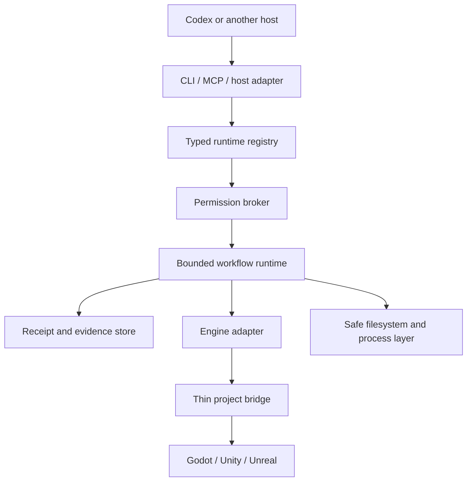

# Target Architecture

> Status: target architecture with a partial control plane. Contracts, the runtime registry, core safety primitives, durable private receipt records and artifact objects, pure process/test result normalization, managed-pack transactions, plan-only `agpb init`, read-only `agpb doctor`, and static read-only `agpb project inspect` exist. General mutation dispatch, evidence export, MCP runtime, host integration, engines, and bridges remain planned.

[한국어](architecture.ko.md) · [Documentation](README.md)

## Overview

The repository uses a pnpm workspace for a Node.js/TypeScript control plane. Engine-specific bridges are planned to remain thin: C# for Unity, Python/C++ for Unreal, and GDScript for Godot. Python is otherwise introduced only for isolated Blender or ML workloads.

The typed registry is the authoring source for command, skill, role-lens, workflow, schema, and pack descriptors. Generation creates CLI, MCP, documentation, and skill-routing metadata from the same validated identity. The runtime registry currently contains `init`, `doctor`, and `project.inspect`; CLI help, parsing, input/output validation, and dispatch consume those exact descriptors. Generated MCP metadata is schema parity data, not an implemented MCP server. The public foundation plan records the runtime-registry digest and keeps unimplemented commands separate.

## Workspace boundaries

| Boundary | Status | Responsibility |
| --- | --- | --- |
| `contracts` | Foundation implemented | Versioned schemas, canonical data, identifiers, approval, workflow, engine, evidence, init-plan, doctor, and project-inspection protocols |
| `registry` | Foundation implemented | Descriptor validation, generation, digesting, routing, workflow-plan resolution, and exact implemented-command inventory |
| `core` | Partial | Canonical project identity, safe paths, compare-and-swap filesystem operations, bounded processes, mutation leases, in-memory permission admission, workflow state, durable checkpoints, append-only run receipts, and private artifact promotion |
| `pack-runtime` | Partial | Write-free preflight, exact ownership, local lifecycle transactions, journals, active barriers, rollback, directory ownership, recovery inspection, and approved stable-state finalization |
| `cli` | Experimental partial | Registry-derived help/version, fail-closed parsing, stable exit categories, human/JSON output, plan-only `init`, read-only `doctor`, and static `project inspect` |
| `evidence` | Partial private foundation | Pure bounded-process and structured-test result normalization exists alongside canonical receipt records, content-addressed artifact bytes, and producer-bound manifests; report parsing, format QA, retention, migration, listing, and explicit export remain planned |
| `mcp` | Planned | Registry-derived tools behind the same broker and result contracts |
| `codex-adapter` | Planned | Project skills, instruction bootstrap, and host routing without new authority |
| `engine-common` | Contract only | Common capability negotiation and engine-operation contracts |
| Engine adapters | Planned | Godot, Unity, and Unreal orchestration without broad host authority |
| Project bridges | Planned | Minimum editor/runtime code needed to expose verified operations |

A partial package is not a claim that its full product surface exists. No current package controls an editor or verifies a live engine frame.

## Current write-free execution flows

The implemented CLI path is deliberately narrow:

1. Parse only global help/version or the exact `init`, `doctor`, and `project inspect` commands with their declared flags.
2. Obtain the selected command descriptor from the validated runtime registry.
3. Validate the request against the descriptor-bound input schema.
4. For `init`, bind one canonical root and classify the fixed 16-target layout without writing. For `doctor`, inspect registry parity, Node.js version, project identity, fixed state directories, installed-pack state, and active transaction marker without writing. For `project inspect`, list the root deterministically, resolve selected marker paths through the bound root, read bounded marker/profile files twice through stable identities, and preserve dirty/process gaps without external execution.
5. Derive plan or diagnostic status from bounded target/check outcomes.
6. Validate semantic counts, identity and digest bindings where applicable, then validate the complete report against the descriptor-bound output schema.
7. Render human or canonical JSON output and map it to a stable exit category.

Handler digests attest the compiled init, doctor, and project-inspection modules separately. Cross-package tests fail if any executable artifact and registry metadata drift.

## Planned mutating execution flow

The general flow remains a target rather than an executable CLI path:

1. Detect a project and build an exact `GameProjectProfile`.
2. Negotiate an `EngineCapabilityReport`; unsupported operations retain a reason and evidence gap.
3. Validate a `FeatureContract`, permission classes, budgets, owned paths, and expected dirty state.
4. Resolve and attest a finite workflow plan against the current registry and project stage.
5. Acquire one project mutation lane and, when needed, bind one exact editor session.
6. Execute registered commands with bounded output, timeout, cancellation, and no default mutation retry.
7. Persist state transitions, receipts, and evidence.
8. Reconcile identity and dirty state after reload, restart, failure, or rollback.

Unknown mutation state goes to `uncertain` and cannot return directly to execution.

## Consumer project state

A consuming game project is planned to contain `.ai-game-playbook/`. Portable profiles, feature contracts, policies, and pack locks are commit-worthy. Cache, logs, screenshots, local receipts, locks, secrets, and machine-specific configuration remain ignored.

The plan-only `init` command reports 16 fixed targets spanning committed metadata intent and local-only runtime intent. It never supplies profile/policy bytes or calls a mutation primitive. The implemented private bootstrap can create only 11 fixed runtime directories, including receipt, artifact-object, and artifact-manifest directories. It is idempotent, rejects links and case aliases, verifies parent and target identities, and removes only directories created by a clearly failed call. `doctor` reads this layout but never calls the bootstrap. `project inspect` may validate the fixed committed profile path, but it cannot create, repair, or promote profile data.

The private receipt and artifact stores require their fixed local directories to exist. Artifact promotion snapshots each complete project-local source into a digest-addressed immutable object. The promoted receipt directly attests each canonical manifest digest and original source path; each manifest binds the retained object and source to the receipt execution context, project and runtime identity, registry, command descriptor, and handler. Receipt persistence binds the same authority to canonical immutable records behind a compare-and-swap run head. Reload validates the bounded predecessor chain and reopens each complete artifact object and manifest twice within the declared byte budget; the original source may change after promotion without changing the retained evidence. Corrupt, relocated, rebound, or competing state is preserved and rejected. Format/decode QA, retention cleanup, evidence CLI, export, and historical-registry migration do not exist.

The private evidence package also converts already-bounded process observations and already-structured test-report observations into immutable component outcomes. It revalidates process identity, timing, output counters, and termination invariants; preserves cancellation and termination uncertainty; and never copies raw stdout or stderr into the normalized result. Test normalization distinguishes an unavailable or inconsistent report, zero discovered tests, all-skipped execution, assertion failure, missing required test IDs, and a process failure after a passing report. It does not execute a process, parse an engine report, discover required tests, persist a receipt, or verify an engine.

Pack preflight binds the validated registry, source and target root identities, local artifact bytes, installed-state digest, intended changes, conflicts, and limits into a same-process immutable plan. Execution additionally requires exact `install` authorization and an attested project-write lease. Canonical installed state is committed last. Clear failures roll back already committed files in reverse; uncertain effects stop without retry.

An active marker and append-only journal preserve interruption state. The read-only recovery inspector performs two bounded observations. A separate finalizer requires a fresh exact approval and lane, re-inspects before each closure boundary, may close only an attested stable state, and never repairs artifacts or resolves mixed state. `doctor` only reports malformed installed state or marker presence; it does not invoke that recovery path.

## Identity and execution lanes

Runtime authority is planned to bind project root identity, project profile digest, feature contract digest, process executable and start identity, editor session nonce, scene or world identity, registry digest, handler digest, and pack digest where relevant. PID, port, process name, or window title alone is insufficient.

Execution lanes are:

- `parallel-read` for bounded immutable inspection;
- `project-write` for project source and managed metadata;
- `editor-bound` for one exact editor session inside project serialization; and
- `build-bound` for approved test and build work.

The current `init`, `doctor`, and `project inspect` descriptors declare `parallel-read`, but general parallel-reader coordination is not yet implemented. Mutating lanes remain one lease per project and require explicit renewal.

## Engine adapter boundary

The common target contract is `detect → negotiate → inspect → mutate → save → compile/import → test → play → deterministic input → logs → capture → profile → build/export → rollback`.

Each adapter must separate offline inspection, headless execution, editor preview, actual play, and packaged runtime evidence. Thin bridges receive only typed bounded operations. They must authenticate the exact project/session, limit request and output sizes, report both outer transport and inner operation outcomes, and return changed objects, files, save/import state, logs, and evidence locators.

Godot is the first planned adapter, followed by Unity and Unreal. The current engine support grade for all three remains `planned`.

## Degradation and support claims

Capability grades are `planned`, `detected`, `headless`, `editor-preview`, and `verified`. A command being available does not raise an engine capability grade. Missing tools, ambiguous instances, unavailable live editors, absent tests, incomplete captures, and unknown performance environments must produce explicit degradation or an unverified outcome.

Windows x64 is the first build target. Linux is initially a static/headless control-plane CI target. macOS, mobile, console, XR, multiplayer, and browser-first games remain outside the first alpha.
